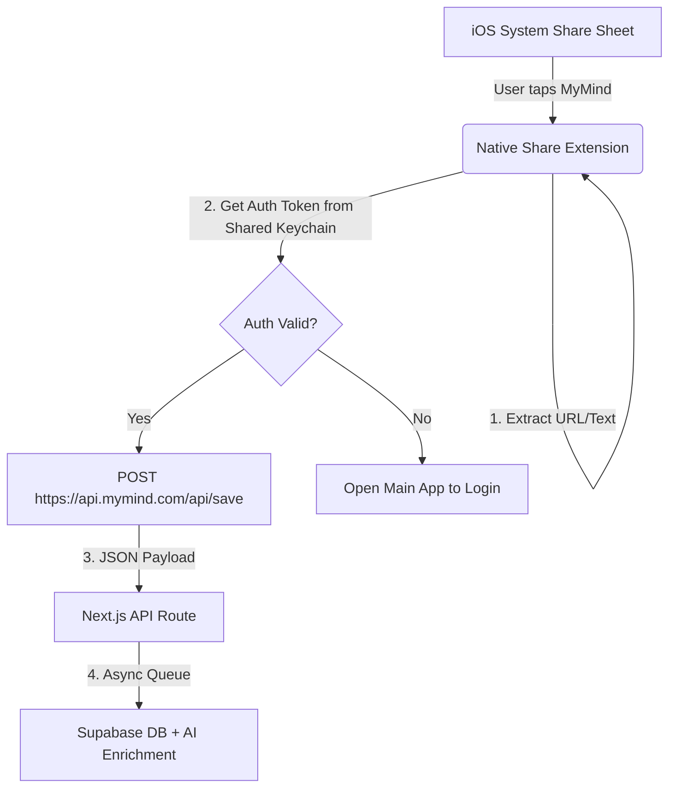

Here is the comprehensive **Product Requirement Document (PRD)** designed for your agentic workflow. It strictly adheres to the architecture defined in your `CLAUDE.md` and leverages the specific MCP tools you requested (`playwriter`, `dev-browser`, `chrome-dev-tools`) for verification.

This document is formatted to be dropped directly into your `docs/specs/` folder so your AI agent can read it and begin execution immediately.

---

# PRD: iOS Share Sheet Integration (Capacitor)

**Status:** Draft `v1.0`
**Owner:** AI Agent (Claude)
**Context:** [CLAUDE.md](https://www.google.com/search?q=./CLAUDE.md), [PROJECT_CHARACTERISTICS.md](https://www.google.com/search?q=./PROJECT_CHARACTERISTICS.md)
**Target Release:** Beta 1.1

---

## 1. Objective & Philosophy

**Goal:** Enable users to save URLs and text from any iOS app (Safari, Twitter/X, Reddit) directly to MyMind without opening the main application.

**Philosophy Alignment:**

* **Anti-Tool:** The interaction must be invisible. No "success" modals that require dismissal. Tap "Save" -> Done.
* **Speed First:** The extension must close immediately. Content processing happens asynchronously on the server.
* **Visual First:** The saved item must appear in the grid immediately upon next app open (Optimistic UI).

## 2. Technical Architecture

The feature requires a "bifurcated" architecture to maintain the Next.js codebase while utilizing native iOS capabilities.



### Key Constraints (Non-Negotiable)

1. **Zero UI Rewrite:** The Share Extension UI is native Swift (SwiftUI), but the logic is minimal (~50 lines).
2. **Background Upload:** Do **not** use deep links (`mymind://save?url=...`) to open the app. The save must happen in the background.
3. **Shared Credentials:** The Main App (Capacitor) and the Share Extension must share a **App Group** to access the Supabase Session Token via the iOS Keychain.

## 3. Feature Specifications

### 3.1. The "Main App" Responsibilities (Capacitor)

* **Token Sync:** On every app launch/login, write the current Supabase Session Token to the `UserDefaults` (suitably encrypted or Keychain) within the shared **App Group**.
* **App Group Config:** Must be configured in `App.entitlements` to allow data sharing with the extension.

### 3.2. The iOS Share Extension (Swift)

* **Activation:** Appears only for `public.url` and `public.plain-text` content types.
* **UI:** Minimal native view.
* *Top:* "Cancel" / "Post" buttons.
* *Center:* Preview of the URL/Text.
* *Bottom:* "Saved to MyMind" indicator.


* **Network Request:**
* `POST /api/save`
* **Headers:** `Authorization: Bearer <TOKEN_FROM_KEYCHAIN>`, `Content-Type: application/json`
* **Body:**
```json
{
  "content": "https://example.com/article",
  "type": "url", // or "text"
  "source": "ios_share_sheet"
}

```


* **Error Handling:** If the token is missing/invalid, fail gracefully or prompt to open the main app.

### 3.3. The API Endpoint (`/api/save`)

* **Performance:** Must respond `200 OK` in <200ms (fire-and-forget enrichment).
* **Enrichment:** Trigger the existing GLM-4.7 pipeline *after* responding to the client.

## 4. Implementation Plan (Agentic Workflow)

### Phase 1: Verification of API Contract (Web Side)

* **Action:** Modify `POST /api/save` to handle the `source: "ios_share_sheet"` payload.
* **Validation (MCP: Playwriter):** Create a test that sends a curl/fetch request mimicking the iOS extension to ensure the Next.js API handles the "headless" save correctly without CSRF blocking issues.

### Phase 2: Native Configuration (iOS Side)

* **Action:**
1. Add `Share Extension` target to `ios/App/App.xcworkspace`.
2. Create App Group `group.com.mymind.share` in Apple Developer Portal.
3. Configure `Info.plist` query schemes.


* **Note:** This step requires generating Swift code, but it should be treated as a "black box" script execution by the agent.

### Phase 3: The "Keychain Bridge"

* **Action:** Implement the logic in the Main App to sync Auth State.
* **Validation (Manual/Sim):** Requires running the app in Simulator, logging in, and verifying the token exists in the Shared Group.

## 5. Testing & Verification Strategy (MCP)

This project uses **Spec-Based Testing**. The Agent must pass these checks before marking the PRD as complete.

### 5.1. Playwriter (API Contract)

> **Prompt for Agent:** "Use `playwriter` to create a spec file `tests/api-share-contract.spec.ts`. It must POST to `/api/save` with a mock Bearer token and a URL. Assert response time is <200ms and status is 200."

* **Test Case 1:** Valid URL payload -> 200 OK.
* **Test Case 2:** Invalid/Expired Token -> 401 Unauthorized.
* **Test Case 3:** Rate Limit Check (spam saves).

### 5.2. Chrome-Dev-Tools (Performance)

> **Prompt for Agent:** "Use `chrome-dev-tools` to profile the `/api/save` endpoint. Ensure no heavy computations (like AI summarization) are blocking the main thread response. The Waterfall must show the response closing before enrichment begins."

### 5.3. Dev-Browser (End-to-End Simulation)

> **Prompt for Agent:** "Use `dev-browser` to login to the web app. Verify that a card manually inserted into the DB (simulating the share extension) appears in the Masonry Grid upon refresh without hydration errors."

## 6. Definition of Done

1. [ ] `POST /api/save` accepts external requests with Bearer tokens.
2. [ ] Playwright test `share-flow.spec.ts` passes (green).
3. [ ] iOS Project compiles with the new Share Extension target.
4. [ ] Shared App Group is defined in `CapacitorConfig` and `Info.plist`.
5. [ ] Response latency for save action is confirmed <200ms via `chrome-dev-tools`
